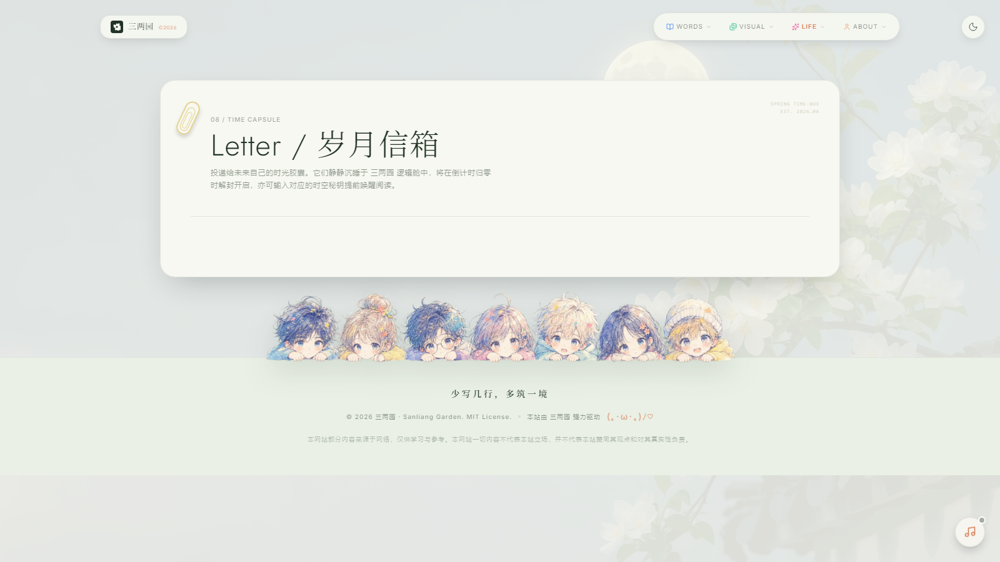
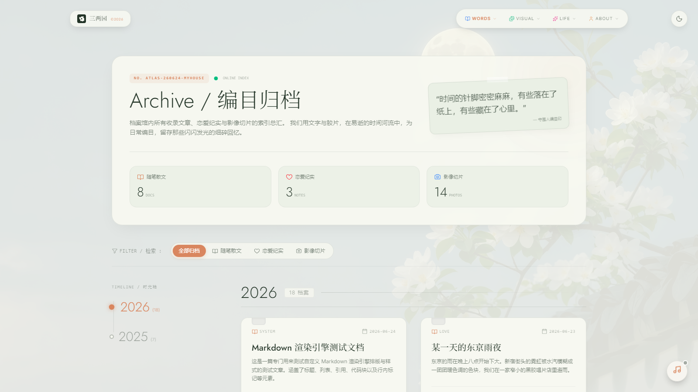
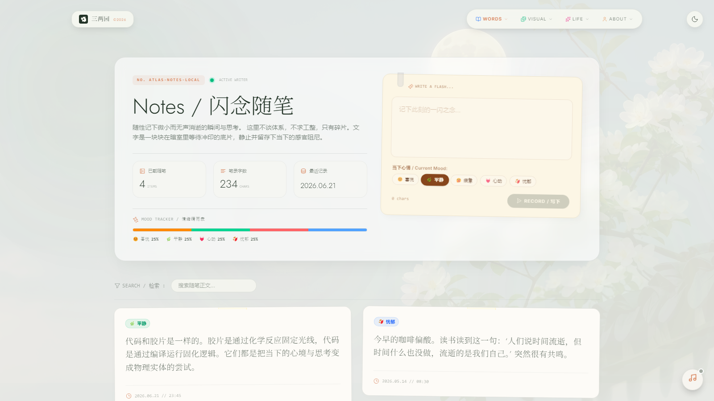
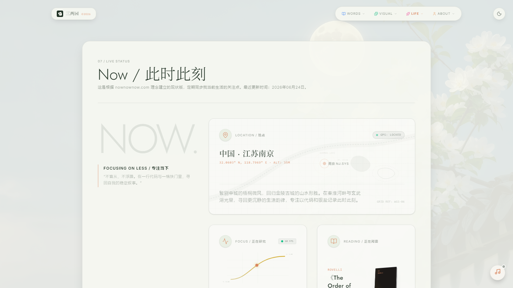
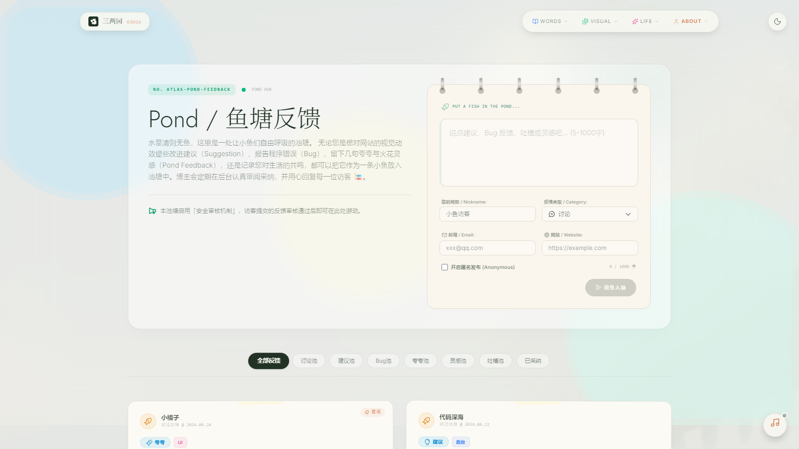
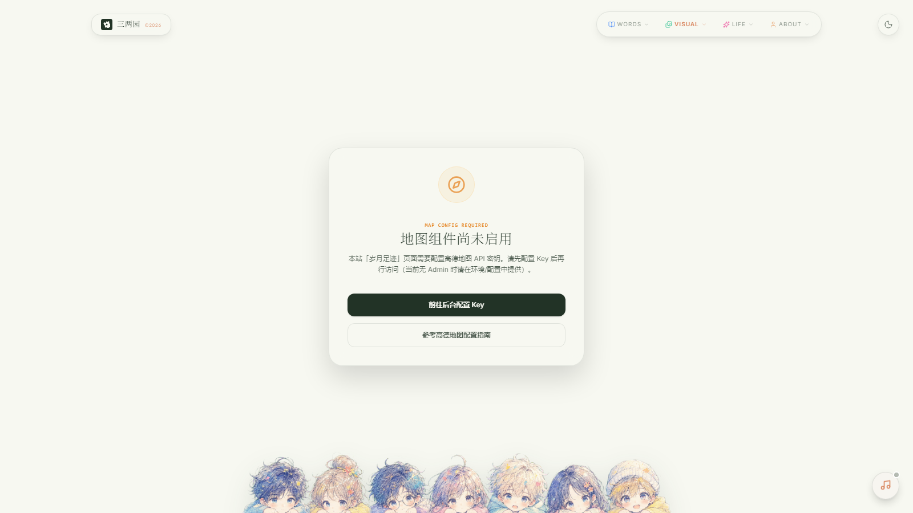
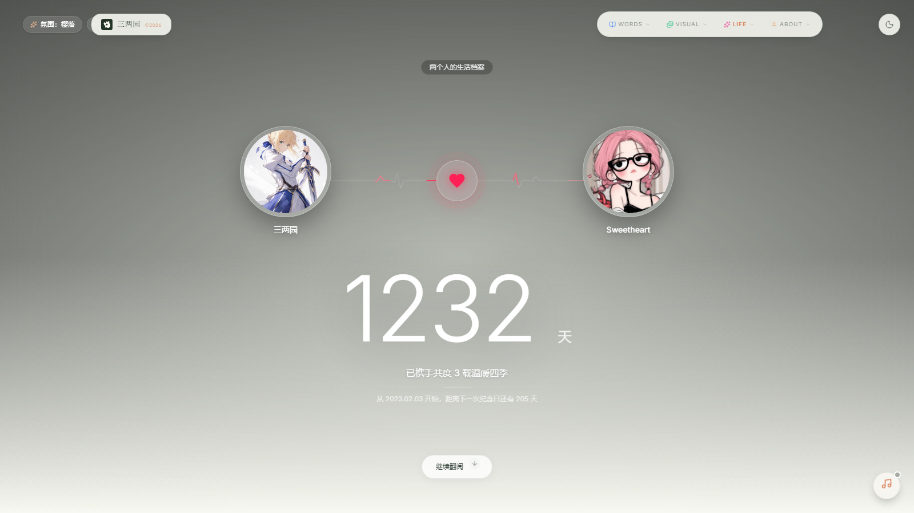
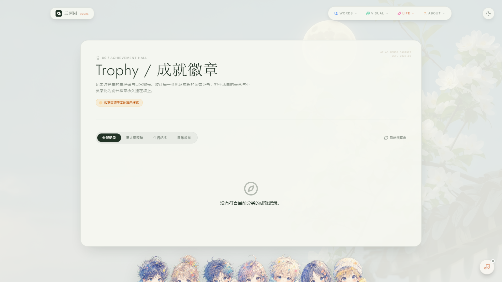

<div align="center">

# 三两园 · Sanliang Garden

*"少写几行，多筑一境。"*

个人博客与生活数字档案前端 — 将文章、影像、足迹与私人记忆整合为统一数字花园的展示层。
Next.js 16 App Router · React 19 · TypeScript 5 · Tailwind CSS 4 · GSAP + Lenis

> 项目继承自上游博客系统，致敬原作者。

<p>
  <strong>中文</strong> · <a href="./README.en.md">English</a>
</p>

</div>

<p align="center">
  
</p>

<p align="center">
  <a href="https://threetwoa-digital-garden.vercel.app"></a>
  
  
  <a href="https://github.com/Aafff623/threetwoa-digital-garden"></a>
</p>

<p align="center">
  <a href="#为什么">为什么</a> ·
  <a href="#功能">功能</a> ·
  <a href="#preview">Preview</a> ·
  <a href="#showcase">Showcase</a> ·
  <a href="#快速开始">快速开始</a> ·
  <a href="#架构">架构</a> ·
  <a href="#访问链路">访问链路</a> ·
  <a href="#目录结构">目录结构</a> ·
  <a href="#路线图">路线图</a> ·
  <a href="#文档">文档</a>
</p>

---

## 为什么

个人内容鲜少居于一处：文章在笔记应用，照片在相册，轨迹散落地图，私密记忆寄存社交平台 — 彼此时间线割裂，导出格式互不兼容。

**三两园** 将这些切面收敛至一套有意识设计的前端壳层：

- 文章、笔记、照片墙、足迹与时间胶囊，视为同一档案的不同分枝，而非独立信息流
- Blog（本仓库）/ Admin / Server 三端分责：展示、运营、持久化，边界明确
- Next.js App Router 服务端优先渲染；GSAP + Lenis 提供编辑级叙事的动效体验，同时不破坏语义结构

这不是通用 CMS 皮囊，也不是无限瀑布流相册。这是一座可持续浇灌、修剪、生长的 **数字花园**。

## 功能

<p align="center">
  
</p>

| 模块 | 说明 | 状态 |
| --- | --- | :---: |
| **文章** | 列表、分类、归档、全文搜索、Markdown 渲染 | ✅ |
| **照片墙** | 瀑布流布局，灯箱预览，按分类筛选 | ✅ |
| **足迹** | 地图标点与行程回顾 | ✅ |
| **恋爱纪实** | 双人时间线、愿望清单与记忆轨道 | ✅ |
| **时间胶囊** | 定向未来信件，到期揭晓 | ✅ |
| **成就** | 个人里程碑与可收集徽章体系 | ✅ |
| **鱼塘** | 访客留言、点赞与逐条回复 | ✅ |
| **主题系统** | 五套视觉预设：`life` / `swiss` / `minimalist` / `glass` / `brutalist` | ✅ |
| **响应式壳层** | 自适应栅格、暗色模式设计令牌 | ✅ |
| **动效** | Lenis 平滑滚动、GSAP ScrollTrigger 滚动驱动动画 | ✅ |

> **边界**：v0.1 面向单人站点。后台 Admin 负责内容管理；多租户与团队协作不在当前范围。

## Preview

本仓是**单产品 Web 应用**，不维护资产 Gallery / 组件预览站（无 `preview-shell.png`、无 `src/website-preview/`）。

对外演示以下方 **Showcase** 真机相册为主。若只需校对 README 排版，使用仓库根的本地预览壳：

```bash
# 在仓库根执行（勿用 file://）
python -m http.server 8095
# 浏览器打开 http://127.0.0.1:8095/preview-readme.html
```

| 产物 | 回答的问题 |
|---|---|
| `preview-readme.html` | README 渲染出来长什么样？ |
| `showcase-*.png` | 产品主链路长什么样？ |

## Showcase

以下为 Playwright 在 `1600×900` 视口下的真机截图。完成本地 [快速开始](#快速开始) 后，可按推荐路径自行走查。

### 推荐演示路径

```
首页 hero / 导航 → /writing 文章列表 → 点开一篇 Markdown 阅读
  → /gallery 照片墙 → /love 恋爱纪实 → /about 关于作者
  → /notes 碎片 → /achievements 成就 → /pond 鱼塘反馈
```

### 页面相册

> 点击缩略图可放大查看。

| | | |
|:---:|:---:|:---:|
| [](assets/images/readme/showcase-home.png)<br><br>**首页**<br>hero · 导航 · 滚动动效 | [](assets/images/readme/showcase-writing.png)<br><br>**文章列表**<br>归档分组 · 标签 · 搜索 | [](assets/images/readme/showcase-article-detail.png)<br><br>**文章详情**<br>Markdown · 提示块 · 代码高亮 |
| [](assets/images/readme/showcase-gallery.png)<br><br>**照片墙**<br>瀑布流 · 灯箱 · 分类 | [](assets/images/readme/showcase-about.png)<br><br>**关于**<br>作者简介 · 坐标 · 自我切片 | [](assets/images/readme/showcase-letter.png)<br><br>**岁月信件**<br>时间胶囊 · 倒计时 · 揭晓 |
| [](assets/images/readme/showcase-archive.png)<br><br>**年份归档**<br>按年索引 · 时间线 | [](assets/images/readme/showcase-notes.png)<br><br>**日常碎片**<br>短内容 · 轻量记录 | [](assets/images/readme/showcase-now.png)<br><br>**当前状态**<br>正在读 · 正在听 · 正在做 |
| [](assets/images/readme/showcase-pond.png)<br><br>**鱼塘反馈**<br>留言 · 点赞 · 回复 | [](assets/images/readme/showcase-footprints.png)<br><br>**足迹**<br>地图标点 · 行程回顾 | [](assets/images/readme/showcase-love.png)<br><br>**恋爱纪实**<br>时间线 · 愿望清单 · 记忆轨 |
| [](assets/images/readme/showcase-achievements.png)<br><br>**成就徽章**<br>里程碑 · 可收集徽章 | | |

在线 Demo：[threetwoa-digital-garden.vercel.app](https://threetwoa-digital-garden.vercel.app)

## 快速开始

### 环境要求

- Node.js `>= 20.9.0`
- npm（或 pnpm）
- （可选）已启动的 [spring_server](https://github.com/Aafff623/spring_server)，默认 `http://localhost:8080/api`；仅预览 UI 可省略，前端将自动回退至本地静态数据

### 1. 克隆与安装

```bash
git clone https://github.com/Aafff623/threetwoa-digital-garden.git
cd threetwoa-digital-garden
npm ci
```

### 2. 环境变量

创建 `.env.development`：

```dotenv
# 浏览器同源请求 /api，由 Next.js rewrites 转发
NEXT_PUBLIC_API_BASE_URL=/api

# Server Component、SSR 与 rewrites 使用的后端地址
SERVER_API_BASE_URL=http://localhost:8080/api
```

生产环境使用 `.env.production`，键名相同，指向内网 API 主机。

### 3. 启动

```bash
npm run dev
```

打开 [http://localhost:3000](http://localhost:3000)。

### 常用命令

| 命令 | 说明 |
| --- | --- |
| `npm run dev` | 开发服务器 |
| `npm run lint` | ESLint（core-web-vitals + TypeScript） |
| `npm run build` | 生产构建（`output: "standalone"`） |
| `npm run start` | 启动生产服务 |
| `npm test` | Vitest |
| `python -m http.server 8095` | README 本地预览壳 |

提交前请至少执行 `npm run lint` 与 `npm run build`。

## 架构

<p align="center">
  
</p>

| 端 | 技术栈 | 职责 | 仓库 |
| --- | --- | --- | --- |
| **Blog** | Next.js 16 · React 19 · TypeScript 5 · Tailwind CSS 4 | 面向访客的展示前台 | 本仓库 |
| **Admin** | Vue | 内容与站点配置后台 | [spring_admin](https://github.com/Aafff623/spring_admin) |
| **Server** | Java Spring Boot | API、鉴权、持久化与文件 | [spring_server](https://github.com/Aafff623/spring_server) |

### 前端数据流

```text
Server Component / RSC
  → src/api/*                 （Axios · SERVER_API_BASE_URL）
  → 后端不可用时回退 src/data/* · src/mock/*

Client Component
  → src/hooks/*               （useArticles · useSysConfig 等）
  → 浏览器 /api               （NEXT_PUBLIC_API_BASE_URL）
  → Next.js rewrites          → spring_server
```

### 技术栈分层

<p align="center">
  
</p>

| 分层 | 选型 |
| --- | --- |
| **框架** | Next.js 16 App Router、React 19、TypeScript 5 |
| **样式** | Tailwind CSS 4、CSS 变量主题、五套视觉预设 |
| **动效** | GSAP + ScrollTrigger、Lenis、Framer Motion |
| **数据** | Axios、同构 API 模块、Hooks、静态兜底 |
| **内容** | 自定义 Markdown、Highlight.js、Leaflet |

## 访问链路

<p align="center">
  
</p>

| 步骤 | 用户行为 | 技术侧 |
| --- | --- | --- |
| 1 | 打开首页 | RSC 预取公共配置与最新文章，首屏直出 |
| 2 | 浏览 `/writing` | 客户端 Hook 拉取列表；失败回退至 `writingData` 静态数据 |
| 3 | 进入文章详情 | App Router `[slug]` 服务端渲染 Markdown |
| 4 | 切换主题 | `StyleConsole` 写入 `localStorage`，CSS 变量即时生效 |
| 5 | 鱼塘留言 | 浏览器请求 `/api/pond/*`，Next.js rewrites 转发至 spring_server |

## 目录结构

<p align="center">
  
</p>

```text
spring_blogs/
├─ src/                    # 产品层
│  ├─ api/                 # 统一 Axios 与领域接口
│  ├─ app/                 # App Router 页面、布局、主题 CSS
│  │  └─ styles/themes/    # life · swiss · minimalist · glass · brutalist
│  ├─ components/          # 页面区块与可复用 UI
│  ├─ hooks/ · data/ · mock/
│  └─ icon/ · interface/
├─ assets/images/readme/   # README 契约图 + Showcase
├─ docs/
│  ├─ agents/              # 任务流（无 language.md / context.md）
│  ├─ adr/ · glossary/ · knowledge/
│  └─ outputs/             # report · prd · handoff · commit-history
├─ preview-readme.{html,css,js}
├─ AGENTS.md · CONTEXT.md · LANGUAGES.md · CLAUDE.md
└─ public/                 # 应用静态资源
```

**约定**

- 新接口优先纳入 `src/api/*`，避免在组件内散落请求逻辑
- 品牌身份统一走 [`src/data/identity.ts`](./src/data/identity.ts)，禁止硬编码
- 新路由遵循 `src/app/{route}/page.tsx`
- 首屏优先服务端获取并附带本地回退；需要交互时再用客户端 Hook

### Key docs

| 文档 | 路径 |
|---|---|
| Agent 门禁 | [`AGENTS.md`](./AGENTS.md) |
| 领域事实 | [`CONTEXT.md`](./CONTEXT.md) |
| 共享用词 | [`LANGUAGES.md`](./LANGUAGES.md) |
| 任务流 | [`docs/agents/workflow.md`](./docs/agents/workflow.md) |
| ADR | [`docs/adr/`](./docs/adr/) |
| 配图 brief | [`docs/outputs/prd/readme-diagrams/`](./docs/outputs/prd/readme-diagrams/) |

## 路线图

| 阶段 | 目标 | 状态 |
| --- | --- | :---: |
| MVP | 文章、照片墙、关于、主题切换 | ✅ 完成 |
| 生活档案 | 足迹、恋爱、时间胶囊、成就、鱼塘 | ✅ 完成 |
| 体验打磨 | 动效优化、加载性能、SEO | 🟡 进行中 |
| 内容运营 | Admin 与 Server 管理功能完善 | 🟡 进行中 |
| 多平台分发 | i18n、RSS、Open Graph 自动化出图 | ⬜ 规划中 |

## 文档

| 文档 | 路径 | 说明 |
| --- | --- | --- |
| 开发约定 | [`CLAUDE.md`](./CLAUDE.md) | 架构、命令、环境变量与编码规范 |
| 项目标准 | [`AGENTS.md`](./AGENTS.md) · [`CONTEXT.md`](./CONTEXT.md) · [`LANGUAGES.md`](./LANGUAGES.md) | Agent 约束、域事实、共享词表 |
| 英文 README | [`README.en.md`](./README.en.md) | English documentation |
| Init 迁移 ADR | [`docs/adr/0003-migrate-outputs-plural-and-cursor-rules.md`](./docs/adr/0003-migrate-outputs-plural-and-cursor-rules.md) | `docs/outputs` + Cursor MDC |
| 五维调研 | [`docs/outputs/report/project-init-full-2026-08-04/`](./docs/outputs/report/project-init-full-2026-08-04/) | Full 模式老项目调研 |
| README 配图 brief | [`docs/outputs/prd/readme-diagrams/readme-diagram-brief.md`](./docs/outputs/prd/readme-diagrams/readme-diagram-brief.md) | 章节与配图契约 |
| 资源说明 | [`assets/README.md`](./assets/README.md) · [`assets/ASSET-MANIFEST.md`](./assets/ASSET-MANIFEST.md) | 媒体约定与资产清单 |

## 开源说明

本项目采用 [MIT License](./LICENSE)。

公开部署前请核查：

- `.env*` 不得包含令牌、数据库密码或云存储访问密钥
- `public/`、`assets/` 与 mock 数据中，移除不应公开的个人影像与敏感信息
- 地图坐标、恋爱记录、时间胶囊信件等，应由部署者替换为自有数据

---

<div align="center">

**三两园 · Sanliang Garden** · 有意识的归档 · 克制的动效 · 可降级的数据层

</div>
