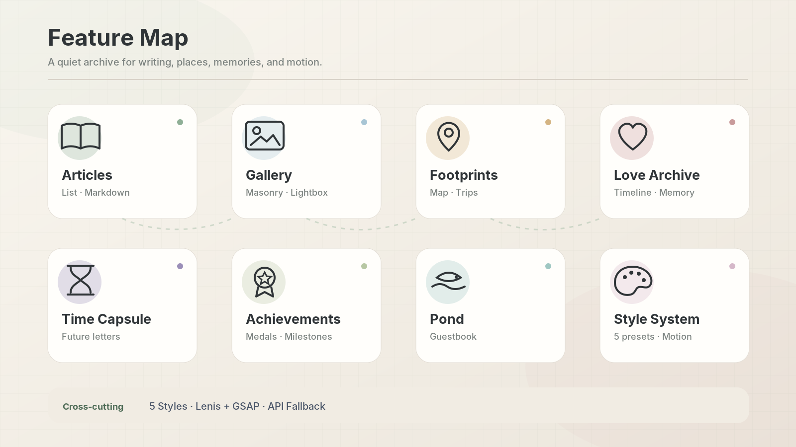
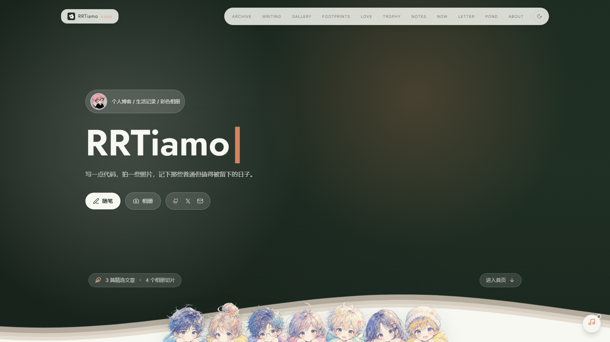
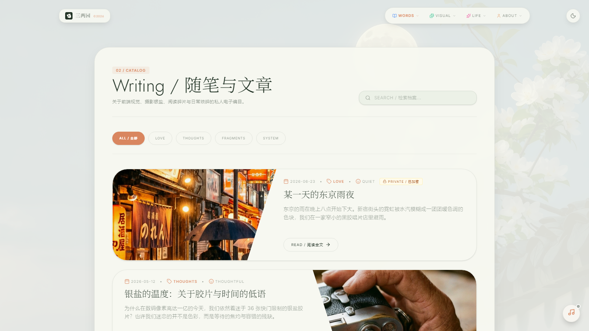
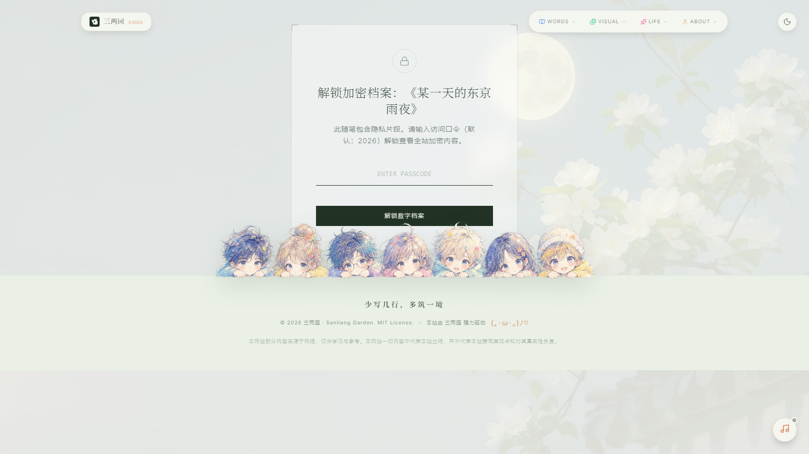
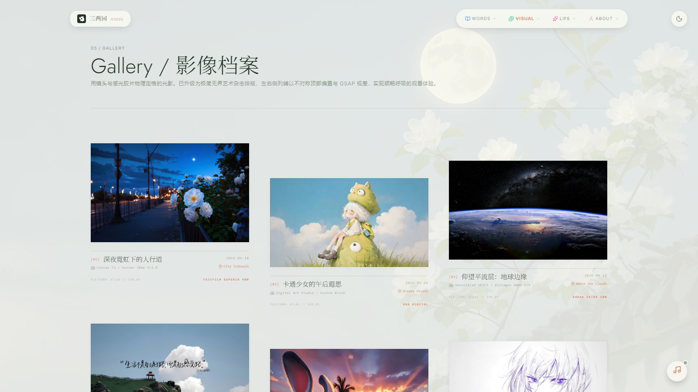
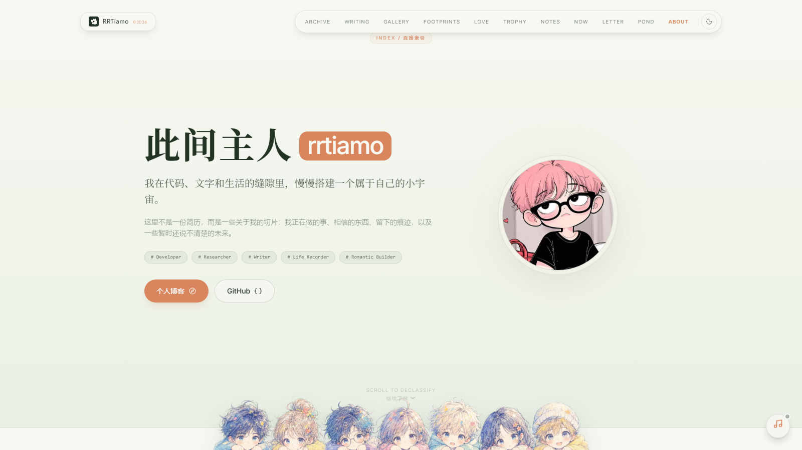
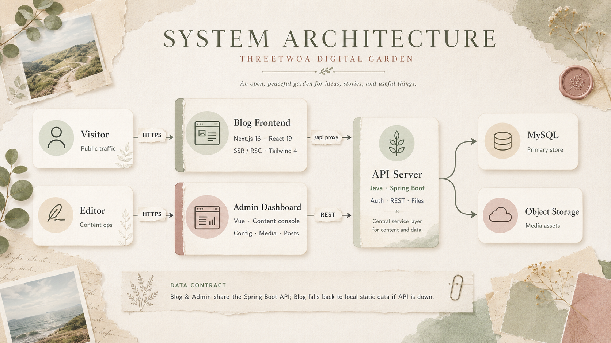
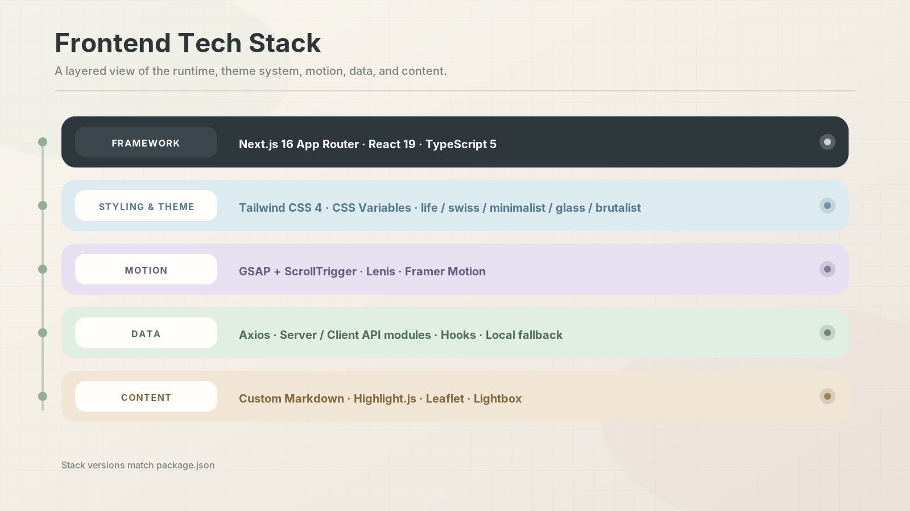
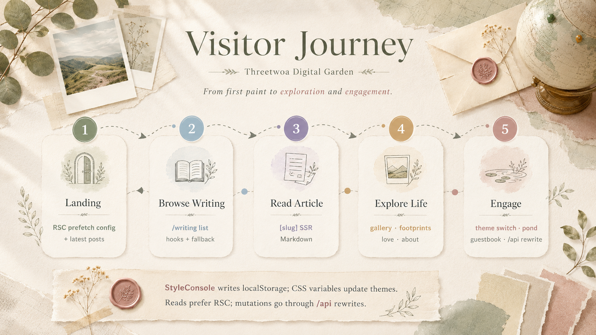
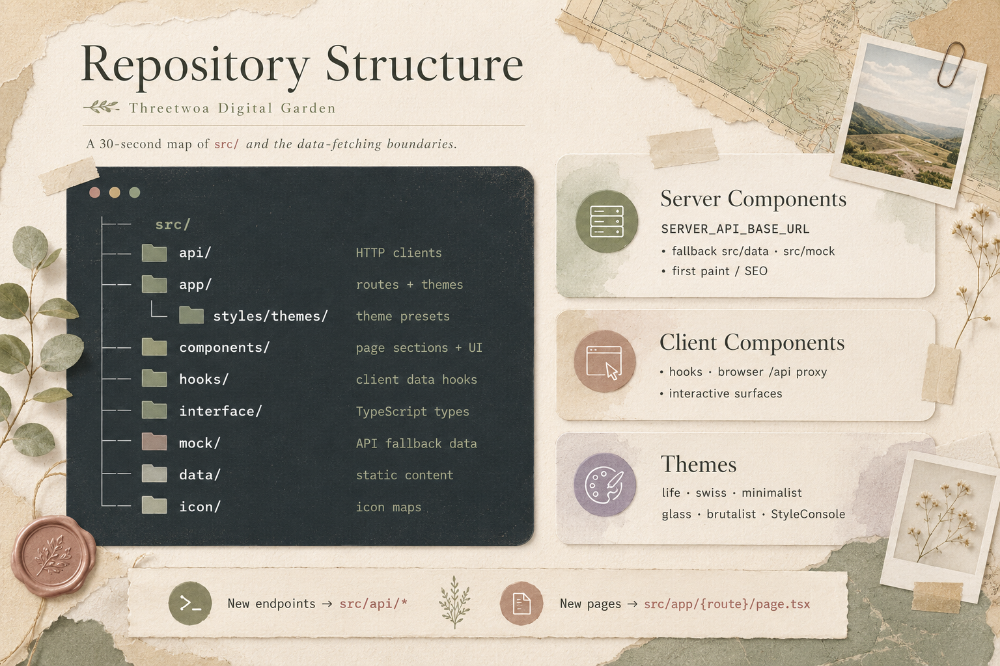

# Threetwoa Digital Garden

> *A personal blog and life-archive frontend — long-form writing, photos, footprints, and private memories in one curated surface.*

<p align="center">
  
</p>

<div align="center">

  
  
  
  

  
  
  
  

  [Why](#why) · [Features](#features) · [Showcase](#showcase) · [Quick Start](#quick-start) · [Architecture](#architecture) · [Workflow](#workflow) · [Structure](#structure) · [Roadmap](#roadmap) · [Docs](#docs)

</div>

---

## Why

Personal content rarely lives in one place. Writing ends up in notes apps, photos in albums, travel traces on maps, and private memories on social platforms — each with its own timeline and export story.

**Threetwoa Digital Garden** consolidates those surfaces into a single, intentionally designed frontend:

- Treat articles, short notes, galleries, footprints, and time capsules as one coherent archive rather than disconnected feeds
- Split responsibilities across Blog (this repo), Admin, and Server so presentation, operations, and persistence stay cleanly bounded
- Use Next.js App Router for server-first rendering, with GSAP + Lenis for magazine-like motion without sacrificing structure

This is not a generic CMS skin or infinite photo feed. It is a **digital garden**: a long-lived, editable public archive you can keep growing.

## Features

<p align="center">
  
</p>

| Module | Description | Status |
| --- | --- | --- |
| **Articles** | Listing, categories, archive, search, Markdown reading | ✅ Ready |
| **Gallery** | Masonry wall with lightbox and category browsing | ✅ Ready |
| **Footprints** | Map markers and trip retrospectives | ✅ Ready |
| **Love archive** | Shared timeline, wishlist, and memory rail | ✅ Ready |
| **Time capsule** | Letters to the future with scheduled reveal | ✅ Ready |
| **Achievements** | Personal milestones and collectible medals | ✅ Ready |
| **Pond** | Guestbook with likes and replies | ✅ Ready |
| **Style system** | Five presets: `life` / `swiss` / `minimalist` / `glass` / `brutalist` | ✅ Ready |
| **Responsive shell** | Adaptive layout with dark-mode-friendly tokens | ✅ Ready |
| **Motion** | Lenis smooth scroll + GSAP ScrollTrigger | ✅ Ready |

> **Scope**: v0.1 targets a single personal site. Admin manages content; multi-tenant or team collaboration is out of scope.

## Showcase

Playwright captures at `1600×900`. After [Quick Start](#quick-start), walk the recommended path below.

### Recommended path

1. Open the home page — hero, navigation, and scroll motion
2. Visit `/writing` — article list and archive grouping
3. Open any article — Markdown body, callouts, and code highlighting
4. Browse `/gallery` and `/about` — photo wall and profile narrative

### Page gallery

| Surface | Capture |
| --- | --- |
| **Home** |  |
| **Writing list** |  |
| **Article detail** |  |
| **Gallery** |  |
| **About** |  |

## Quick Start

### Prerequisites

- Node.js `>= 20.9.0`
- npm (or pnpm)
- [spring_server](https://github.com/RRTiamo/spring_server) running at `http://localhost:8080/api` (optional for UI-only browsing; the frontend falls back to local static data)

### 1. Clone and install

```bash
git clone https://github.com/Aafff623/threetwoa-digital-garden.git
cd threetwoa-digital-garden
npm ci
```

### 2. Environment

Create `.env.development`:

```dotenv
# Browser requests stay same-origin; Next.js rewrites forward to the API
NEXT_PUBLIC_API_BASE_URL=/api

# Used by Server Components, SSR, and rewrites
SERVER_API_BASE_URL=http://localhost:8080/api
```

Production builds use `.env.production` with the same keys pointed at the internal API host.

### 3. Run

```bash
npm run dev
```

Open [http://localhost:3000](http://localhost:3000).

### Scripts

| Command | Purpose |
| --- | --- |
| `npm run dev` | Development server |
| `npm run lint` | ESLint (core-web-vitals + TypeScript) |
| `npm run build` | Production build (`output: "standalone"`) |
| `npm run start` | Serve the production build |

Before commit, prefer `npm run lint` and `npm run build`.

## Architecture

<p align="center">
  
</p>

| Tier | Stack | Responsibility | Repository |
| --- | --- | --- | --- |
| **Blog** | Next.js 16 · React 19 · TypeScript 5 · Tailwind CSS 4 | Public-facing presentation | This repository |
| **Admin** | Vue | Content and site configuration | [spring_admin](https://github.com/RRTiamo/spring_admin) |
| **Server** | Java Spring Boot | API, auth, persistence, files | [spring_server](https://github.com/RRTiamo/spring_server) |

### Frontend data flow

```text
Server Component / RSC
  → src/api/*                 (Axios · SERVER_API_BASE_URL)
  → fallback src/data/* · src/mock/* when the API is unavailable

Client Component
  → src/hooks/*               (useArticles · useSysConfig · …)
  → browser /api              (NEXT_PUBLIC_API_BASE_URL)
  → Next.js rewrites          → spring_server
```

### Tech stack layers

<p align="center">
  
</p>

| Layer | Choices |
| --- | --- |
| **Framework** | Next.js 16 App Router, React 19, TypeScript 5 |
| **Styling** | Tailwind CSS 4, CSS variable themes, five style presets |
| **Motion** | GSAP + ScrollTrigger, Lenis, Framer Motion |
| **Data** | Axios, isomorphic API modules, hooks, static fallbacks |
| **Content** | Custom Markdown renderer, Highlight.js, Leaflet |

## Workflow

<p align="center">
  
</p>

| Step | User action | What the stack does |
| --- | --- | --- |
| 1 | Open home | RSC prefetches public config and latest posts for first paint |
| 2 | Browse `/writing` | Client hooks load the list; failures fall back to `writingData` |
| 3 | Open an article | App Router `[slug]` SSR-renders Markdown |
| 4 | Switch style | `StyleConsole` writes `localStorage`; CSS variables update immediately |
| 5 | Leave a pond message | Browser hits `/api/pond/*`, rewritten to spring_server |

## Structure

<p align="center">
  
</p>

```text
src/
├─ api/              # Shared Axios clients and domain endpoints
├─ app/              # App Router pages, layout, theme CSS
│  └─ styles/themes/ # life · swiss · minimalist · glass · brutalist
├─ components/       # Page sections and reusable UI
├─ hooks/            # Client-side data and config hooks
├─ icon/             # Icon mappings
├─ interface/        # Shared TypeScript contracts
├─ mock/             # Offline / failure fallback fixtures
└─ data/             # Lightweight static content
```

**Conventions**

- New endpoints belong in `src/api/*`, not inline in components
- New routes follow `src/app/{route}/page.tsx`
- Prefer server fetch with local fallback for first paint; use client hooks when interactivity requires it

## Roadmap

| Phase | Goal | Status |
| --- | --- | --- |
| MVP | Articles, gallery, about, style switching | ✅ Done |
| Life archive | Footprints, love, time capsule, achievements, pond | ✅ Done |
| Experience | Motion polish, loading performance, SEO | 🟡 In progress |
| Content ops | Admin and Server management capabilities | 🟡 In progress |
| Distribution | i18n, RSS, Open Graph image pipeline | ⬜ Planned |

## Docs

| Document | Path | Notes |
| --- | --- | --- |
| Development guide | [`CLAUDE.md`](./CLAUDE.md) | Architecture, commands, env vars, coding conventions |
| Project standards | [`AGENTS.md`](./AGENTS.md) · [`CONTEXT.md`](./CONTEXT.md) · [`LANGUAGES.md`](./LANGUAGES.md) | Agent constraints, domain facts, shared vocabulary |
| Project init spec | [`docs/knowledge/project-init.md`](./docs/knowledge/project-init.md) | Repository initialization playbook |
| Init decision | [`docs/adr/0001-apply-project-init.md`](./docs/adr/0001-apply-project-init.md) | ADR for Phase A/B execution and branch unification |
| README diagram brief | [`docs/output/prd/readme-diagrams/readme-diagram-brief.md`](./docs/output/prd/readme-diagrams/readme-diagram-brief.md) | Section plan, asset contract |
| GPT image prompts | [`docs/output/prd/readme-diagrams/readme-image-prompts.md`](./docs/output/prd/readme-diagrams/readme-image-prompts.md) | Per-image elements, references, ready-to-copy prompts |
| Asset manifest | [`assets/ASSET-MANIFEST.md`](./assets/ASSET-MANIFEST.md) | README media inventory and SVG sources |
| README assets | [`assets/images/readme/`](./assets/images/readme/) | Banner, diagrams, Playwright showcase captures |
| Assets note | [`assets/README.md`](./assets/README.md) | Media conventions and current asset layout |

> Preview stand: this repository is a single product surface. There is no separate component gallery / demo wall; product screens are covered by **Showcase** only.

## License

No open-source license is attached. Until a root `LICENSE` is added, **all rights are reserved**.

Before any public deployment, review:

- `.env*` must not contain tokens, database passwords, or cloud credentials
- `public/`, `assets/`, and mock data should not ship private photos or personal information you do not intend to publish
- Map coordinates, relationship records, and time-capsule letters should be replaced with deployer-owned content

---

<div align="center">

**Threetwoa Digital Garden** · curated archive · intentional motion · resilient data layer

</div>
