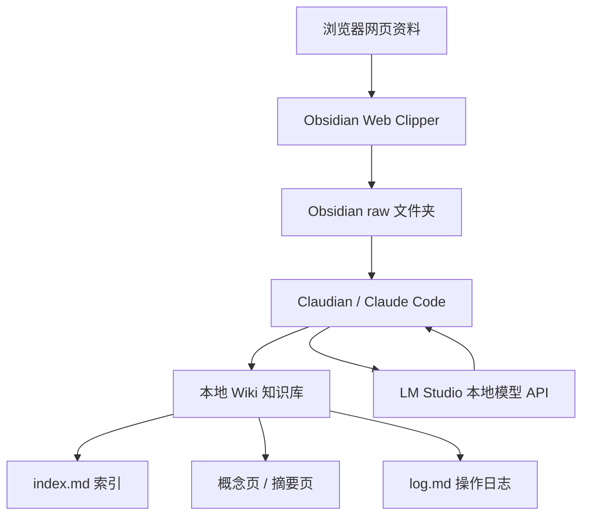
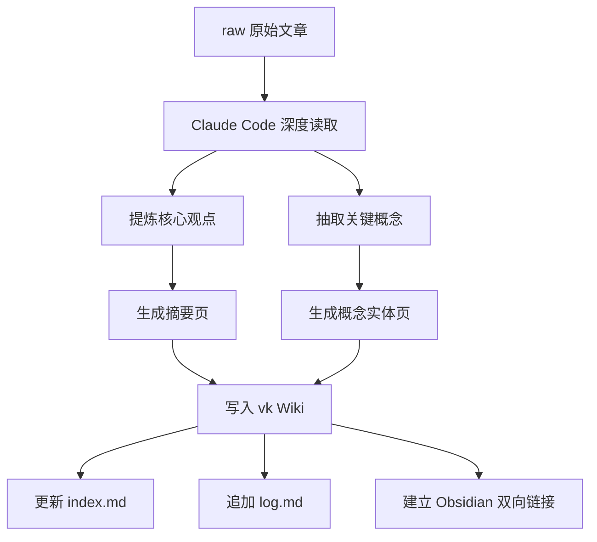

## 手把手用 Claude Code + Obsidian 搭建本地 AI 知识库

### 核心摘要
- 这个视频讲的是：虽然 Claude Code 名字里带着 "Code"，但它并不只适合写代码。对于普通用户来说，它更有价值的用法，是和 Obsidian、LM Studio、本地开源模型结合，搭建一个可以在本机运行、能读写笔记、能自动整理资料的本地 AI 知识库。
- 视频的核心思路来自 Andrej Karpathy 提出的 LLM Wiki 方法论：人不再手动维护标签、索引和双链，而是只负责把原始资料丢进知识库，由 AI 像"编译器"一样，把原始材料整理成结构化 Wiki，包括摘要页、概念页、索引页和操作日志。这个系统和传统 RAG 的区别在于，它不是一次性检索后给答案，而是会把高质量问答、分析结果继续写回知识库，让知识不断沉淀和复利增长。
- 整套方案主要由四部分组成：Obsidian 负责本地 Markdown 笔记库，Claude Code 负责作为智能代理读写文件，LM Studio 负责在离线场景下运行本地大模型，Obsidian Web Clipper 负责把网页内容一键保存为 Markdown。最终形成的工作流是：收集资料 → 放入 raw 文件夹 → Claude Code 编译成 Wiki → 更新索引和双链 → 用户提问 → 生成答案并沉淀回知识库。

> [!note] 通俗摘要
> 用 Obsidian 存笔记，用 Claude Code 当"AI 员工"按规则整理资料，用 LM Studio 在本地跑大模型。核心不是"本地部署"这个噱头，而是把知识整理从"人工记账"变成"AI 编译"——你只管丢材料，系统自动生成结构化 Wiki，问得越多知识库越值钱。

---

### 工具清单

#### 核心工具
| 工具 | 作用 | 备注 |
|---|---|---|
| Claude Code | 作为 AI Agent，负责读写文件、搜索、整理、生成内容 | 虽然主打代码场景，但可用于知识库管理 |
| Obsidian | 本地 Markdown 笔记库 | 所有文件本地保存，适合作为知识库底座 |
| LM Studio | 下载并运行本地开源大模型 | 用于完全离线、隐私敏感场景 |
| Obsidian Web Clipper | 浏览器剪藏插件 | 将网页一键保存为 Markdown 到 Obsidian |
| BRAT | Obsidian 第三方 Beta 插件安装器 | 用于安装未上架官方市场的 Claudian |
| Claudian | 将 Claude Code 嵌入 Obsidian 侧边栏 | 让 Obsidian vault 成为 Claude Code 的工作目录 |

#### 各工具之间的关系



> [!note] 通俗摘要
> 工具链的核心是 Claudian，它让 Claude Code 直接操作 Obsidian 笔记库。Web Clipper 负责收集，LM Studio 负责离线推理，Obsidian 负责存储。

---

### 环境准备

#### Step 1：安装 Claude Code
- 视频没有展开 Claude Code 的具体安装命令，建议优先看官方文档。
- 安装完成后，需要能够在终端中正常调用：
```bash
claude
```
- 如果终端里能够正常打开 Claude Code 的交互界面，说明基础安装成功。

> 实操建议：遇到安装问题先查官方文档，避免因版本、系统权限或 Node 环境差异导致配置失败。

#### Step 2：安装 Obsidian
- Obsidian 是这套知识库的本地文件系统底座，核心优势是：
  - 所有笔记以 Markdown 文件形式保存在本地
  - 文件结构清晰，可被 Claude Code 直接读写
  - 支持双向链接，适合构建 Wiki 式知识网络
  - 插件生态丰富，能接入剪藏、AI、自动化工作流

#### Step 3：安装 LM Studio
- 如果你的知识库内容不涉及隐私或敏感数据，可以直接使用在线模型，不一定需要 LM Studio。
- 但如果要整理的是个人隐私数据、公司内部资料、商业文档等不适合上传云端的内容，就需要 LM Studio 来运行本地模型。
- LM Studio 的作用是：
  1. 下载开源大模型
  2. 在本机加载模型
  3. 启动本地 API 服务
  4. 让 Claude Code 调用本地模型

> 技术参数：LM Studio 本地服务常见地址是 `http://localhost:1234`

#### Step 4：安装 Obsidian Web Clipper
- 使用方式：
  1. 在 Chrome 或 Edge 插件商店搜索 Obsidian Web Clipper
  2. 安装插件，配置保存位置到 `raw/` 目录
  3. 之后遇到文章，点击插件图标即可保存为 Markdown

---

### 本地大模型部署

#### Step 1：在 LM Studio 中选择模型
- 可以在 LM Studio 内直接搜索并下载开源模型，例如 Qwen、DeepSeek 等。
- 选择模型时，不建议只看参数量，要重点看两个指标：

| 指标 | 含义 |
|---|---|
| 量化模型文件大小 | 模型本体加载所需空间 |
| KV Cache 占用 | 长上下文推理时缓存占用的显存 / 统一内存 |

- 模型能否流畅运行，取决于：
```
模型文件大小 + KV Cache 占用 + 运行时额外开销 < 可用显存 / 可用统一内存
```

> 类比说明：KV Cache 就像"草稿纸"——模型越大、上下文越长，需要的草稿纸越多。参数量只是"解题能力"，草稿纸才是"能同时做几道大题"的关键。

> [!note] 通俗摘要
> 本地模型的瓶颈不是参数量，而是显存/内存够不够跑长上下文。30B Q4 模型 + 128K 上下文，整体可能需要 30GB+ 显存。

#### Step 2：硬件要求判断

##### 普通知识库场景
- 如果资料不敏感，可以使用在线模型，普通笔记本或台式机都可以完成 Obsidian 管理、Claude Code 调用云端模型、Web Clipper 剪藏、AI 辅助整理。

##### 完全离线场景
- 如果需要完全离线运行本地模型，对硬件有明显要求：

| 硬件项 | 建议 |
|---|---|
| 内存 | 至少 32GB |
| 显存 / 可用统一内存 | 理想情况 16GB 以上 |
| 长上下文需求 | 128K、200K 会显著增加 KV Cache 占用 |

> 关键结论：离线知识库的瓶颈主要在显存/统一内存容量，尤其是长上下文和大模型同时使用时。

---

### 连接 Claude Code 与本地模型

#### Step 1：找到 Claude Code 配置文件
- 在系统用户目录中找到 `.claude/settings.json`
- 主要改三类内容：API endpoint、auth token、模型 ID

#### Step 2：修改配置
- 将 API endpoint 改成 LM Studio 的本地服务地址：`http://localhost:1234`
- auth token 可以随便填字符占位（本地 LM Studio 通常不需要真实鉴权）
- 把涉及模型名称的字段统一改成你在 LM Studio 中下载并加载的模型 ID

> 实操建议：不要死记视频里的字段名，Claude Code 版本变化可能导致配置项不同。真正要抓住的是三个配置目标：本地 API 地址、占位鉴权、模型 ID。

---

### 安装 Obsidian 端插件

#### Step 1：安装 BRAT
- Claudian 还没有发布到 Obsidian 官方插件市场，需要先安装 BRAT
- 安装路径：Obsidian 设置 → 第三方插件 → 浏览 / 安装 BRAT

#### Step 2：通过 BRAT 安装 Claudian
- 在 BRAT 中添加 Claudian 的开源项目地址，BRAT 会自动拉取并安装
- Claudian 的作用是将 Claude Code 嵌入 Obsidian 侧边栏，让 Obsidian vault 成为 Claude Code 的工作目录

> [!note] 通俗摘要
> 最终效果：左侧是 Obsidian 知识库（Markdown 文件与双链），右侧是 Claude Code 助手（AI 读写、整理、生成），可以实时查看内容变化。

---

### 核心步骤：构建本地 AI 知识库

#### Step 1：创建空 Obsidian Vault
- 先在 Obsidian 中创建一个新的空库，作为整个本地 AI 知识库的根目录

#### Step 2：导入 Karpathy 的 LLM Wiki 方法论文章
- 把 Andrej Karpathy 的 LLM Wiki 原文放入 Obsidian
- 在 Claudian 中向 Claude Code 下达指令：`请深度阅读这篇文章，并根据其中的方法论初始化我的知识库。`

#### Step 3：自动生成核心目录
| 文件 / 目录 | 作用 |
|---|---|
| raw/ | 原始资料收件箱，保存所有未处理材料 |
| vk/ | LLM 专属 Wiki 区域，存放整理后的结构化页面 |
| index.md | vk 文件夹的目录大纲 |
| log.md | 只追加、不覆盖的操作日志 |
| CLAUDE.md | 给 Claude Code 的工作手册，规定整理规则 |

其中最关键的是 **`CLAUDE.md`**，它相当于给 AI 写的一份"员工手册"，定义目录结构、标签规则、双向链接规则、原始材料处理方式、Wiki 页面生成规范、操作日志写入规则。

> 关键结论：CLAUDE.md 是整套系统的"宪法"。很多 AI 工作流失败，不是模型不够聪明，而是没有给它稳定、可复用、可检查的工作规则。

---

### 知识库的 Ingest / 编译流程

#### Step 1：收集网页资料
- 用 Obsidian Web Clipper 把文章保存为 Markdown，放入 `raw/` 目录

#### Step 2：通知 Claude Code 处理新文章
- 在 Claudian 中输入类似指令：`raw 文件夹里新增了一篇文章，请处理它。`

#### Step 3：AI 像"编译器"一样处理资料
- 视频中特别强调，这一步不叫"阅读"，而叫"编译 / compile"
- Claude Code 会执行：
  1. 读取 raw 中的原始 Markdown
  2. 提炼文章核心观点
  3. 生成文章摘要页
  4. 抽取关键概念
  5. 为关键概念创建独立实体页
  6. 使用 Obsidian 双向链接关联相关内容
  7. 更新 index.md
  8. 向 log.md 追加处理记录



> 类比说明：编译器把源代码变成可执行程序，Claude Code 把原始笔记变成结构化 Wiki。区别是编译器输出二进制，它输出的是可直接查阅的知识点。

> [!note] 通俗摘要
> "编译"比"总结"更准确。总结是一次性文本压缩，编译是把材料纳入既有知识结构，让它和旧知识发生连接。

---

### 查询知识库：区别于传统 RAG 的关键点

#### 传统 RAG 的问题
- 传统 RAG 通常是：用户提问 → 系统检索相关片段 → 模型基于片段生成答案 → 对话结束后上下文消失 → 下次提问重新检索
- 缺点是：问答结果不一定沉淀、每次都像从零开始、很难形成长期复用的知识结构

#### 这套 LLM Wiki 系统的查询方式
- 用户提问后，Claude Code 会先打开 index.md 浏览知识库目录，找到相关 Wiki 页面，逐个读取后综合生成带来源引用的回答
- 更重要的是，它可以把高质量回答继续保存回 Wiki 中，成为新的分析报告
- 这意味着：每次提问都可能增加知识库内容，知识库不是静态文件夹，而是持续演化的系统

> 关键结论：知识库不只是"存资料的地方"，而是一个会把交互结果继续沉淀下来的系统。问得越多，整理得越深，后续使用价值越高。

---

### 最终形成的目录结构示例
```
AI-Knowledge-Base/
├── raw/
│   ├── article-001.md
│   ├── article-002.md
│   └── ...
├── vk/
│   ├── index.md
│   ├── concepts/
│   │   ├── LLM-Wiki.md
│   │   ├── RAG.md
│   │   └── Knowledge-Compilation.md
│   ├── summaries/
│   │   ├── article-001-summary.md
│   │   └── article-002-summary.md
│   └── reports/
│       └── analysis-001.md
├── index.md
├── log.md
└── CLAUDE.md
```

---

### CLAUDE.md 的作用与建议内容

#### 1. 角色定义
```markdown
你是这个 Obsidian 知识库的维护者，负责将 raw 文件夹中的原始资料编译为结构化 Wiki。
```

#### 2. 目录规则
```markdown
- raw/：保存未处理原始资料，不要随意改写。
- vk/：保存整理后的 Wiki 页面。
- index.md：维护知识库目录。
- log.md：只追加操作日志，不覆盖历史记录。
```

#### 3. 处理规则
```markdown
每次处理 raw 中的新资料时，需要：
1. 读取全文；2. 提炼核心观点；3. 生成摘要；
4. 抽取关键概念；5. 创建或更新概念页；
6. 添加双向链接；7. 更新 index.md；8. 追加 log.md。
```

#### 4. 双链规则
```markdown
所有重要概念都应使用 Obsidian 双向链接，例如 [[RAG』、『LLM Wiki』、『知识编译]]。
```

> 实操建议：如果要长期使用这套系统，CLAUDE.md 不应一次写死，而应该随着你的知识库习惯持续迭代。它越清晰，AI 输出越稳定。

---

### 视频中的三点最终总结

1. **写好 CLAUDE.md** —— 先给 AI 制定规则，它像一份员工手册，决定 Claude Code 后续如何处理文件

2. **把原始材料丢进 raw 文件夹** —— 用户不再需要手动整理所有资料，只要专注于收集高质量输入

3. **让本地 AI 编译成 Wiki** —— Claude Code 会根据 CLAUDE.md，把 raw 中的内容整理为结构化知识库

---

### 适合使用这套方案的人

| 用户类型 | 是否适合 | 原因 |
|---|---|---|
| 经常收藏文章但不整理的人 | 很适合 | 可以把整理任务交给 AI |
| 研究人员 / 学生 | 很适合 | 适合沉淀论文、资料和概念网络 |
| 程序员 / 产品经理 | 适合 | 可整理技术文档、需求、方案 |
| 公司内部知识库维护者 | 适合，但建议本地化 | 涉及隐私时需要本地模型 |
| 只偶尔记笔记的人 | 不一定必要 | 搭建成本可能高于收益 |
| 低配置电脑且想完全离线跑大模型的人 | 不太适合 | 本地大模型硬件门槛较高 |

---

### 关键洞见整理

#### 洞见一：Claude Code 不只是编程工具
- 它的本质更接近一个能操作本地文件系统的 AI Agent。只要工作对象是文本文件，它就能参与整理、改写、索引和维护。
- 批注：Claude Code 的价值不只在"生成代码"，而在"按规则持续操作一个项目目录"。知识库本质上也可以被看作一个项目。

#### 洞见二：知识库维护的痛点不是存储，而是整理
- 传统知识库难以坚持，是因为人讨厌做标签、索引、链接、摘要这些琐碎工作
- 这套方案的思路是：人负责输入，AI 负责维护结构

#### 洞见三：LLM Wiki 比一次性 RAG 更强调"知识复利"
- 传统 RAG 是临时回答问题，LLM Wiki 则会把回答本身继续沉淀成知识资产
- 每次提问都不只是消费知识，也是在扩充知识库

#### 洞见四：离线方案的真正成本在硬件
- 如果只是体验 AI 知识库，在线模型加 Obsidian 就够了
- 但如果追求完全离线、本地隐私、大模型、长上下文、大规模知识库，就必须认真考虑显存、内存和模型量化规格

---

### 可复用操作清单

#### 初始化阶段
- [ ] 安装 Claude Code
- [ ] 安装 Obsidian
- [ ] 安装 LM Studio
- [ ] 安装 Obsidian Web Clipper
- [ ] 安装 BRAT
- [ ] 通过 BRAT 安装 Claudian
- [ ] 在 LM Studio 下载合适的本地模型
- [ ] 启动 LM Studio Server
- [ ] 修改 `.claude/settings.json`
- [ ] 测试 `claude` 是否能正常运行

#### 知识库搭建阶段
- [ ] 创建新的 Obsidian vault
- [ ] 放入 Karpathy LLM Wiki 方法论文章
- [ ] 让 Claude Code 初始化知识库
- [ ] 检查是否生成 raw、vk、index.md、log.md、CLAUDE.md
- [ ] 优化 CLAUDE.md 中的整理规则

#### 日常使用阶段
- [ ] 用 Web Clipper 保存网页到 raw
- [ ] 通知 Claude Code 编译新资料
- [ ] 检查摘要页、概念页、双链和索引
- [ ] 向知识库提问
- [ ] 将高质量回答保存回 Wiki
- [ ] 定期检查 log.md 和目录结构

---

### 一句话结论
- 这套方案的本质，是用 Obsidian 管本地文件，用 Claude Code 执行知识整理规则，用 LM Studio 支撑离线模型，把"收藏资料"升级成"由 AI 持续编译和生长的个人 Wiki"。

---

## 规划生成的图片

> [!info] 图片生成计划
> 以下图片将在后续使用 MiniMax 图像生成工具制作：

### 图 1：Claude Code + Obsidian 本地 AI 知识库架构图
**[主题]**：展示本地 AI 知识库的完整工具链和数据流
**[构图]**：横向流程图，左侧是数据输入（网页、文档），中间是核心工具链（Web Clipper → Obsidian → Claudian → Claude Code → LM Studio），右侧是输出（结构化 Wiki）
**[风格]**：深色技术架构图，带有连接线和图标
**[位置]**：放置在"工具清单"章节的核心工具表格之后

### 图 2：LLM Wiki 知识编译流程图
**[主题]**：展示"编译器"式知识处理流程
**[构图]**：垂直流程图，从 raw 原始文章开始，经过提炼、抽取、生成，最终写入 vk Wiki
**[风格]**：简洁的深色主题，带有箭头和模块框
**[位置]**：放置在"知识库的 Ingest / 编译流程"章节

### 图 3：LLM Wiki vs 传统 RAG 对比图
**[主题]**：对比两种知识库范式
**[构图]**：左右分栏，左侧是传统 RAG（用户→检索→回答→消失），右侧是 LLM Wiki（用户→提问→沉淀→增长）
**[风格]**：对比式图解，深色背景
**[位置]**：放置在"查询知识库"章节的开头
