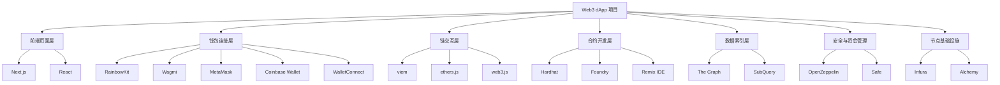

# Web3 主流开发工具选型笔记

## 视频核心主题

这期内容是一个 **Web3 主流开发工具分类与选型指南**，主要围绕 dApp 开发的完整链路展开：
从前端框架、钱包连接、链交互库，到智能合约开发、数据索引、安全工具、节点服务，帮助开发者按项目场景选择合适工具。

> 这类工具清单的价值不在于"全部学完"，而在于先建立 Web3 项目的工具地图。新项目、老项目、小项目、大项目、多链项目，选型侧重点完全不同。

---

## 工具清单

### 1. 前端基础框架

| 分类 | 工具 | 适用场景 | 核心作用 |
|---|---|---|---|
| React 集成框架 | Next.js | dApp 前端项目的常见底座 | 快速搭建兼顾性能与 SEO 的页面 |
| UI / 前端基础库 | React | Web3 前端开发基础 | 构建 dApp 页面与组件交互 |

#### Next.js

Next.js 是当前 Web3 前端项目中较常见的基础框架，适合用于搭建性能较好、结构清晰、同时兼顾 SEO 的页面。

它通常承担 dApp 的前端工程底座角色，例如：

- 项目路由组织
- 页面渲染
- API 路由辅助
- 静态生成或服务端渲染
- 与钱包连接、合约交互组件集成

官网：
https://nextjs.org/

#### React

React 是 Web3 前端的基础 UI 框架。绝大多数 dApp 的界面层、组件层、钱包连接弹窗、交易状态展示等，都会围绕 React 生态构建。

官网：
https://react.dev/

> 如果是从 Web2 前端转 Web3，React + Next.js 基本可以直接作为默认起点。Web3 的特殊性主要不在页面框架，而在钱包、链交互、合约状态和交易流程。

---

### 2. React 封装与钱包交互工具

| 工具 | 适用场景 | 主要特点 |
|---|---|---|
| RainbowKit | 新项目，尤其需要漂亮的钱包连接 UI | 提供成熟的钱包连接界面 |
| Wagmi | 新项目，现代 Web3 React 开发 | 合约交互更灵活，Hooks 体验好 |
| Web3 React | 老项目维护 | 早期常用钱包连接方案 |

#### RainbowKit

RainbowKit 主要用于给 dApp 添加钱包连接界面。
它的优势在于 UI 现成、美观，开发者不需要从零设计钱包连接弹窗。

常见能力包括：

- 钱包连接按钮
- 钱包列表展示
- 链切换
- 账户信息展示
- 与 Wagmi 配合使用

官网：
https://www.rainbowkit.com/

#### Wagmi

Wagmi 是现代 Web3 React 项目中非常常见的工具库，主要用于封装钱包连接、账户状态、链信息和合约交互。

它更适合新项目，尤其是 React 技术栈下的 dApp。

常见能力包括：

- 读取钱包账户
- 监听连接状态
- 切换网络
- 调用合约读方法
- 发起合约写交易
- 与 viem、RainbowKit 配套使用

官网：
https://wagmi.sh/

#### Web3 React

Web3 React 更适合维护早期项目。
它在过去的 Web3 前端项目中使用较多，但对于现代新项目来说，Wagmi + RainbowKit 的开发体验通常更顺滑。

官网：
https://github.com/Uniswap/web3-react

> 新项目优先考虑 RainbowKit + Wagmi；老项目如果已经用了 Web3 React，不一定要强行重构，除非项目后续要长期维护并升级整体技术栈。

---

### 3. 链交互工具库

链交互工具库是前端与区块链网络"对话"的桥梁。
它们负责把前端操作转化为链上读取、交易发送、签名、事件监听等动作。

| 工具 | 适用场景 | 特点 |
|---|---|---|
| viem | 现代前端项目 | 体积小，TypeScript 体验好 |
| ethers.js | 主流项目、成熟项目 | 功能完整，生态成熟 |
| web3.js | 早期以太坊老项目维护 | 历史悠久，适合兼容旧代码 |

#### viem

viem 更适合现代 Web3 前端项目。
它的特点是体积相对轻，TypeScript 支持更好，和 Wagmi 的新版本生态也较为贴合。

适合：

- 新 dApp 项目
- TypeScript 项目
- 希望获得更清晰类型推导的项目
- 现代 React + Wagmi 技术栈

官网：
https://viem.sh/

#### ethers.js

ethers.js 是非常成熟的以太坊交互库，长期以来都是 Web3 项目的主流选择之一。

它适合：

- 主流 EVM 项目
- 对生态稳定性要求较高的项目
- 需要大量参考资料和社区案例的项目
- 已有团队熟悉 ethers.js 的项目

官网：
https://docs.ethers.org/

#### web3.js

web3.js 是更早期的以太坊 JavaScript 工具库。
如果是维护较早期的以太坊项目，仍然可能遇到 web3.js。

但如果是新项目，通常不再作为优先选择。

官网：
https://web3js.org/

> viem 更像是现代 Web3 前端的新默认项；ethers.js 胜在成熟和资料丰富；web3.js 主要价值在兼容历史项目。

---

### 4. 钱包 Connector

钱包 Connector 负责连接用户钱包，是 dApp 获取用户地址、签名授权、发起交易的入口。

| 工具 | 适用场景 | 覆盖用户 |
|---|---|---|
| MetaMask | 主流 EVM 用户 | 使用最广的钱包之一 |
| Coinbase Wallet | Coinbase 生态用户 | 覆盖 Coinbase 用户群体 |
| WalletConnect | 移动端、跨设备连接 | 支持扫码、移动钱包连接 |

#### MetaMask

MetaMask 是最主流的钱包之一，尤其在 EVM 生态里使用广泛。
大多数 dApp 都会优先支持 MetaMask。

官网：
https://metamask.io/

#### Coinbase Wallet

Coinbase Wallet 可以覆盖 Coinbase 生态用户，适合面向海外用户或主流加密用户群体的项目。

官网：
https://www.coinbase.com/wallet

#### WalletConnect

WalletConnect 主要解决跨设备连接问题。
比如用户在电脑网页上打开 dApp，但钱包在手机 App 中，就可以通过扫码连接。

官网：
https://walletconnect.com/

> MetaMask + Coinbase Wallet + WalletConnect 这组组合，基本能覆盖大多数常见用户连接场景。钱包连接不是越多越好，关键是覆盖核心用户和降低连接失败率。

---

### 5. 状态管理工具

Web3 前端除了普通页面状态外，还会涉及钱包连接状态、链 ID、交易状态、合约读取结果、用户资产数据等，因此状态管理工具仍然重要。

| 工具 | 适用场景 | 特点 |
|---|---|---|
| Zustand | 小型项目、中小型 dApp | 轻量、简洁、上手快 |
| Redux | 大型复杂项目 | 规范、可维护性更强 |

#### Zustand

Zustand 适合小项目或中等复杂度项目。
它轻量、写法简单，不需要像 Redux 那样配置较多模板代码。

官网：
https://zustand-demo.pmnd.rs/

适合管理：

- 钱包连接状态
- 用户 UI 偏好
- 简单业务状态
- 局部模块状态

#### Redux

Redux 更适合大型复杂项目。
当项目中状态来源多、模块多、协作人员多时，Redux 的规范性更有优势。

官网：
https://redux.js.org/

适合管理：

- 复杂业务流
- 多模块共享状态
- 大型团队协作
- 可追踪的状态变更

> 小项目不要过早引入重型状态管理。Web3 项目本身已经有链上状态、钱包状态、服务端数据，多一层复杂状态管理会增加维护负担。

---

### 6. 智能合约开发与调试工具

智能合约开发工具是 Web3 后端开发的核心，主要负责合约编译、测试、部署、调试等工作。

| 工具 | 适用场景 | 特点 |
|---|---|---|
| Hardhat | Web3 入门、常规合约开发 | 编译、测试、部署一体化，上手较快 |
| Foundry | 追求高性能、偏 Solidity 原生测试 | 执行速度快，适合进阶开发 |
| Remix IDE | 完全新手、快速试验合约 | 在线使用，无需配置环境 |

#### Hardhat

Hardhat 是智能合约开发中非常常见的工具，适合入门者和常规项目使用。

它可以完成：

- Solidity 合约编译
- 本地测试网络
- 单元测试
- 部署脚本
- 合约调试
- 插件扩展

官网：
https://hardhat.org/

#### Foundry

Foundry 更适合追求高性能和更接近 Solidity 原生开发体验的开发者。
它的测试速度快，常被用于更专业的合约开发、审计辅助和高频测试场景。

官网：
https://book.getfoundry.sh/

#### Remix IDE

Remix IDE 是在线合约开发环境，不需要本地配置。
非常适合完全没有接触过合约开发的新手，用来快速理解 Solidity 合约的编写、编译和部署流程。

官网：
https://remix.ethereum.org/

> 学习路径可以是 Remix 入门概念，Hardhat 做项目，Foundry 做进阶。不要一开始就陷入工具比较，先把合约生命周期跑通更重要。

---

### 7. 数据索引与聚合工具

链上数据虽然公开，但直接从链上读取历史数据效率很低。
数据索引工具的作用是把链上事件、交易、合约状态等整理成更容易查询的数据接口。

| 工具 | 适用场景 | 特点 |
|---|---|---|
| The Graph | 单链或主流链数据索引 | Web3 数据索引标杆 |
| SubQuery | 多链项目 | 多链支持更灵活 |

#### The Graph

The Graph 是 Web3 数据索引领域的标杆工具。
如果项目主要面向单一链，或使用 The Graph 支持较好的生态，可以优先考虑。

官网：
https://thegraph.com/

典型用途：

- 查询 NFT 列表
- 查询 DeFi 交易记录
- 查询用户链上操作历史
- 聚合合约事件数据
- 为前端提供 GraphQL 查询接口

#### SubQuery

SubQuery 更适合多链项目。
如果项目涉及多个区块链网络，SubQuery 的多链支持会更加灵活。

官网：
https://subquery.network/

> 很多新手会误以为前端可以直接查所有链上数据。实际上，复杂 dApp 通常需要索引层，否则历史记录、排行榜、资产聚合这类功能会非常低效。

---

### 8. 安全相关工具

Web3 项目一旦涉及合约与资金，安全工具和安全规范就非常关键。

| 工具 | 适用场景 | 作用 |
|---|---|---|
| OpenZeppelin | 编写智能合约 | 提供经过审计的安全合约库 |
| Safe | 项目资金管理 | 多签钱包，降低单点风险 |

#### OpenZeppelin

OpenZeppelin 提供了大量经过审计和广泛使用的智能合约库。
开发者在编写 ERC20、ERC721、权限控制、升级合约等功能时，可以直接基于这些标准库开发，避免重复造轮子和低级漏洞。

官网：
https://www.openzeppelin.com/

常见模块：

- ERC20
- ERC721
- ERC1155
- Ownable
- AccessControl
- ReentrancyGuard
- Pausable
- Upgradeable Contracts

#### Safe

Safe 是多签钱包工具，适合项目资金管理。
它可以要求多个签名人共同确认交易，避免单个私钥泄露导致项目资金被直接转走。

官网：
https://safe.global/

适合：

- DAO 金库
- 项目方资金账户
- 多人共同管理的合约权限
- 团队 Treasury 管理

> OpenZeppelin 解决的是"合约代码层面的基础安全"，Safe 解决的是"资金管理层面的权限安全"。这两类安全问题不能互相替代。

---

### 9. 基础设施与节点服务

区块链应用需要通过节点读取链上数据、发送交易。
但大多数项目不需要自己跑节点，可以使用第三方节点服务。

| 工具 | 适用场景 | 特点 |
|---|---|---|
| Infura | EVM 链项目 | 稳定，适合以太坊及 EVM 生态 |
| Alchemy | 多链项目、需要扩展工具 | 工具能力较丰富，免费额度适合中小项目 |

#### Infura

Infura 是常见的节点服务商，适合 EVM 链项目。
如果项目主要围绕以太坊或 EVM 生态，Infura 是稳定的选择之一。

官网：
https://www.infura.io/

#### Alchemy

Alchemy 也提供节点服务，并且在多链支持和开发者工具方面较丰富。
中小项目通常可以先使用其免费额度进行开发和早期上线。

官网：
https://www.alchemy.com/

> 节点服务是 Web3 应用的基础依赖。早期可以用免费额度，但正式项目要关注限流、稳定性、备用 RPC、故障切换等问题。

---

## 选型速查表

| 项目情况 | 推荐选择 |
|---|---|
| Web3 前端新项目 | Next.js + React |
| 需要钱包连接 UI | RainbowKit |
| React 中做合约交互 | Wagmi |
| 现代 TypeScript 项目 | viem |
| 主流成熟 EVM 项目 | ethers.js |
| 维护早期老项目 | web3.js / Web3 React |
| 小型 dApp 状态管理 | Zustand |
| 大型复杂项目状态管理 | Redux |
| 合约开发入门 | Remix IDE / Hardhat |
| 常规合约项目开发 | Hardhat |
| 高性能合约测试 | Foundry |
| 单链数据索引 | The Graph |
| 多链数据索引 | SubQuery |
| 合约安全库 | OpenZeppelin |
| 项目资金多签管理 | Safe |
| EVM 节点服务 | Infura |
| 多链节点与开发工具 | Alchemy |

---

## 推荐组合

### 新 Web3 前端项目

```text
Next.js
+ React
+ RainbowKit
+ Wagmi
+ viem
+ Zustand
+ Alchemy / Infura
```

适合大多数新 dApp 项目，尤其是前端以 React 为核心、需要快速接入钱包和合约交互的场景。

---

### 成熟 EVM 项目

```text
Next.js
+ React
+ Wagmi
+ ethers.js
+ Redux
+ Hardhat
+ Infura
```

适合功能较复杂、团队协作较多、需要成熟生态和稳定工具链的项目。

---

### 智能合约学习路径

```text
Remix IDE
→ Hardhat
→ Foundry
→ OpenZeppelin
→ Safe
```

建议先用 Remix 理解合约编写、编译、部署的基本流程，再用 Hardhat 构建正式项目，之后再学习 Foundry 提升测试和开发效率。

---

## 工具链关系图



*图：Web3 dApp 开发工具链全景图*

---

## 核心结论

Web3 开发工具选型不应该只看"哪个最火"，而要按项目实际场景判断：

- ==新项目优先使用现代工具链：RainbowKit、Wagmi、viem。==
- 老项目维护时，不要忽视 Web3 React、web3.js 这类历史工具。
- 小项目状态管理用 Zustand 更轻便，大型复杂项目用 Redux 更规范。
- 合约开发可以从 Remix 入门，再过渡到 Hardhat，进阶使用 Foundry。
- 数据查询复杂后，需要引入 The Graph 或 SubQuery。
- 涉及合约安全时优先使用 OpenZeppelin，涉及资金管理时使用 Safe。
- ==节点服务可以先用 Infura 或 Alchemy，早期中小项目通常免费额度足够。==

> 这份工具图本质上是一张 Web3 项目开发路线图。前端、钱包、链交互、合约、索引、安全、节点服务各司其职，真正的能力不是背工具名，而是知道项目到了哪个阶段该引入哪类工具。
