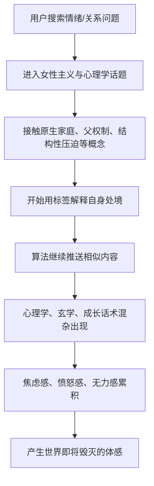

## 核心主题

这段视频以夸张、密集堆叠的方式，模拟用户打开小红书后被大量高频概念、情绪词、身份标签和平台黑话淹没的体验。

它并不是在系统讲解某个具体知识点，而是在讽刺一种典型的平台内容生态：用户原本只是搜索某个话题，比如"女性主义""情绪价值"，但很快会被算法推入一整套高度情绪化、概念化、标签化的内容流之中，最终产生强烈的压抑感、焦虑感和末日感。

> 这类视频的重点不在于逐个解释词语，而在于呈现一种"信息过载后的精神体感"：看得越多，越觉得自己、关系和世界都出了问题。

---

## 内容结构拆解

### 1. 起点：从小红书搜索开始

视频开头设定了一个很日常的动作：用户打开小红书，搜索与女性主义、情绪价值相关的内容。由此触发一连串平台高频议题：

- 女性主义
- 情绪价值
- 原生家庭
- 父权制
- 结构性压迫
- 躯体化
- 边缘化
- 亲密关系
- 容貌焦虑

这些词本身都对应现实中的复杂议题，但在短视频和图文平台中，往往会被压缩成一种快速识别、快速共鸣、快速站队的内容标签。

> 这里讽刺的不是"女性主义"或"原生家庭"等议题本身，而是平台如何把严肃议题加工成高频关键词，再通过推荐机制反复推送。

---

### 2. 中段：议题开始滑向标签化和阵营化

随后，视频中的词汇从社会议题逐渐滑向更具攻击性、对立性和网络化的表达：

| 类型 | 代表词汇 | 指向的问题 |
|---|---|---|
| 性别议题 | 服美役、媚男、雌竞、雄竞 | 对性别关系和审美规训的讨论 |
| 权力关系 | 话语权、主体性、向下兼容、向上社交 | 对关系中权力位置的敏感化 |
| 关系判断 | 沉没成本、配得感、内核稳定 | 将亲密关系转化为自我评估和利益计算 |
| 极端标签 | 敌方坐骑、二手子宫、婚驴、彩礼 | 情绪化、攻击性较强的网络称呼 |

这部分体现出平台内容的一个特点：原本复杂的社会结构问题，会逐渐被简化为一套"判断他人、判断自己、判断关系"的词汇系统。

用户在浏览时，会不断被提醒：

- 你是否被压迫？
- 你是否不够清醒？
- 你是否被关系消耗？
- 你是否没有主体性？
- 你是否在为别人付出过多？

> 这些问题未必没有价值，但当它们以高密度、低语境的方式连续出现时，就容易从"启发思考"变成"制造焦虑"。

---

### 3. 后段：心理学、玄学和网络流行语混杂

视频后半段开始出现更多混杂型内容：

- PTSD
- NPD
- ADHD
- PUA
- 星座
- 塔罗
- 水晶
- 转运
- 磁场
- 氛围感
- 信念感
- 发疯文学

这里呈现的是小红书内容生态中的另一种典型现象：心理学术语、关系诊断、玄学疗愈、自我成长、情绪表达被混合在一起，形成一种"半知识、半疗愈、半消费"的内容场。

用户可能原本只是想寻找安慰或答案，但平台会不断推送新的解释框架：

> 这段的讽刺感很强：当"诊断自己"和"解释世界"的工具过多时，人反而可能失去基本的稳定感。

---

## 视频中的核心观察

### 观察一：平台会把严肃议题变成高频刺激

视频列举的很多词本身具有现实意义，比如父权制、结构性压迫、容貌焦虑、主体性等。但在小红书这类内容平台中，它们经常不再作为完整论证出现，而是以短句、标题、标签、情绪共鸣的方式反复出现。

结果是：

- 概念被快速传播；
- 语境被大量压缩；
- 情绪被不断放大；
- 用户更容易产生"我终于被解释了"的感觉；
- 也更容易陷入"哪里都有问题"的感受。

> 平台不是学术课堂，它更擅长制造即时共鸣，而不是提供完整理解。

---

### 观察二：信息茧房会强化负面世界观

视频最后说，刷完之后会产生"世界即将毁灭"的感觉。这正是整段内容的落点。

当用户连续浏览某类内容时，推荐算法会根据兴趣继续推送相似内容。于是，某些原本只是生活中的局部困境，会被不断放大成整体性的世界判断。

用户可能会从：

- "我最近有点不开心"
- 变成"我的关系有问题"
- 再变成"我的原生家庭有问题"
- 再变成"整个社会结构都有问题"
- 最后变成"这个世界干脆毁灭算了"

> 这种情绪链条并不罕见。问题不在于看见问题，而在于连续不断地只看见问题。

---

### 观察三：自我赋能话术也可能制造新的压力

视频里提到"市场""自我赋能""显化""配得感""内核稳定"等词。这些词通常出现在自我成长、女性成长、情绪疗愈类内容中。

它们表面上是在鼓励人：

- 要自信；
- 要提升自己；
- 要有边界感；
- 要相信自己值得；
- 要摆脱不健康关系。

但当这些话术被过度消费后，也可能变成另一种压力：

- 你不快乐，是不是因为你内核不够稳定？
- 你关系失败，是不是因为你配得感不够？
- 你没有改变人生，是不是因为你信念感不足？
- 你没有成功，是不是因为你还没有真正显化？

> 所谓"赋能"如果脱离现实条件，也可能变成一种温柔包装过的自责。

---

## 关键词分类整理

### 社会议题类

- 女性主义
- 父权制
- 结构性压迫
- 边缘化
- 话语权
- 主体性

这些词对应的是社会结构、性别权力和身份处境的问题。

### 情绪与心理类

- 情绪价值
- 原生家庭
- 躯体化
- PTSD
- NPD
- ADHD
- PUA

这些词常被用于解释个人痛苦、亲密关系创伤和心理状态。

### 关系与婚恋类

- 亲密关系
- 沉没成本
- 配得感
- 向下兼容
- 向上社交
- 婚驴
- 彩礼

这类词强调关系中的投入、回报、权力差异和社会评价。

### 审美与性别规训类

- 容貌焦虑
- 服美役
- 媚男
- 雌竞
- 雄竞

这类词集中在外貌、性别凝视、竞争关系和自我规训上。

### 玄学与疗愈类

- 星座
- 塔罗
- 水晶
- 转运
- 磁场
- 氛围感
- 信念感

这类词更多提供情绪安慰和象征性解释，不一定具备严肃论证基础。

---

## 核心结论

这段视频通过密集堆叠小红书高频词，呈现了一种典型的平台浏览体验：用户从一个普通搜索开始，被算法不断推入女性主义、心理学、亲密关系、玄学、自我成长等混杂话题中，最终产生强烈的信息过载和情绪压迫。

它真正讽刺的是：

1. ==严肃议题被标签化==；
2. 复杂问题被情绪化；
3. 个人困境被不断放大；
4. 自我成长话术可能反过来制造焦虑；
5. 算法推荐会强化用户对世界的负面感知。

> 一句话概括：这不是在说"小红书上的这些议题都没意义"，而是在说，当所有议题都以高密度、高情绪、低语境的方式涌来时，人很容易从"获得解释"滑向"被解释压垮"。
